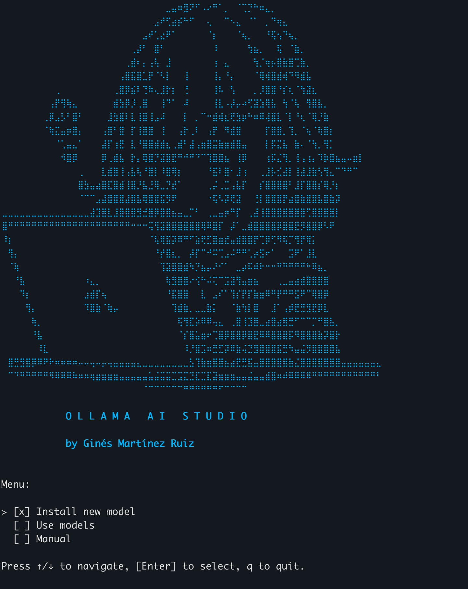

# GoAiBasicStudio

**GoAiBasicStudio** is a terminal user interface (TUI) application built in Go using the BubbleTea framework. It provides a clean and responsive interface for running local LLMs (via Ollama) directly from your terminal, with support for model selection, contextual chat, and real-time streaming of model responses.

This project is designed for developers who need a private, offline LLM experience without any external dependencies or telemetry.

---

## Demo



---

## Features

- Local model discovery using Ollama
- Interactive model selector with `list.Model`
- Streaming responses from selected LLM
- Context-aware conversation history
- Modular architecture (input / runner / model / services)
- 100% offline usage

---

## Requirements

- Go 1.20 or newer
- Ollama installed locally with at least one model pulled  
  Example:
  ```bash
  ollama pull mistral
